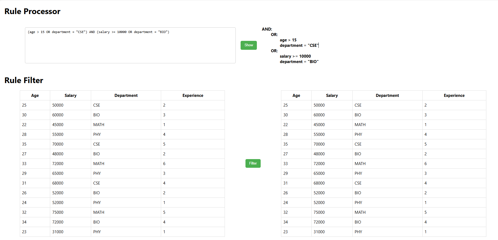
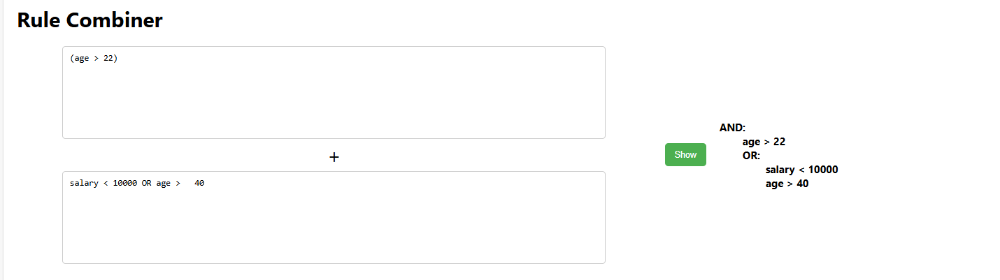

# Rule Engine with Abstract Syntax Tree (AST) for Cohort Evaluation

This project implements a rule engine with an Abstract Syntax Tree (AST) to evaluate cohort membership based on custom rules. The engine allows flexible rule creation and modification using a defined AST structure, with the frontend in React and backend in Flask.

## Project Overview

The rule engine defines complex conditions and expressions using rules, such as:
- `(age > 15 OR department = "CSE") AND (salary >= 10000 OR department = "BIO")`



Rules are stored as ASTs for efficient evaluation, and a JSON-based structure allows easy storage, retrieval, and manipulation in a database. The frontend allows users to create, combine, and evaluate rules, while the backend manages rule storage and processing.

It also comes along with an added functionality of rule combiner which help combining two rule for better search results.



---

## Key Components

### Data Structure - AST Node Representation

Each rule is represented as an AST where each node contains:
- **type**: The node type ("operator" for AND/OR, "operand" for conditions).
- **left**: Reference to a left child Node.
- **right**: Reference to a right child Node (for operators).
- **value**: Optional value for operand nodes, like a number or string for comparisons.

Sample AST Node Structure:
```plaintext
Node {
  type: "operator",
  left: Node { type: "operand", value: "age > 30" },
  right: Node { type: "operator", ... }
}

## Technologies Used 
Frontend -React,HTML,CSS,Javascript
Backend - Flask,


