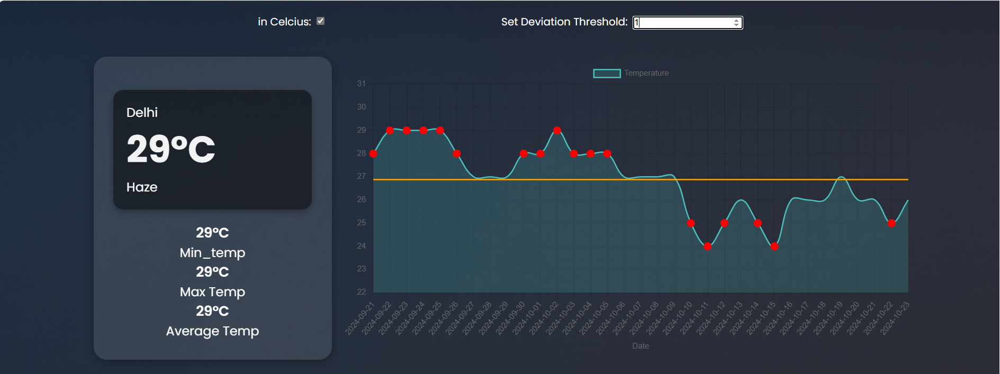
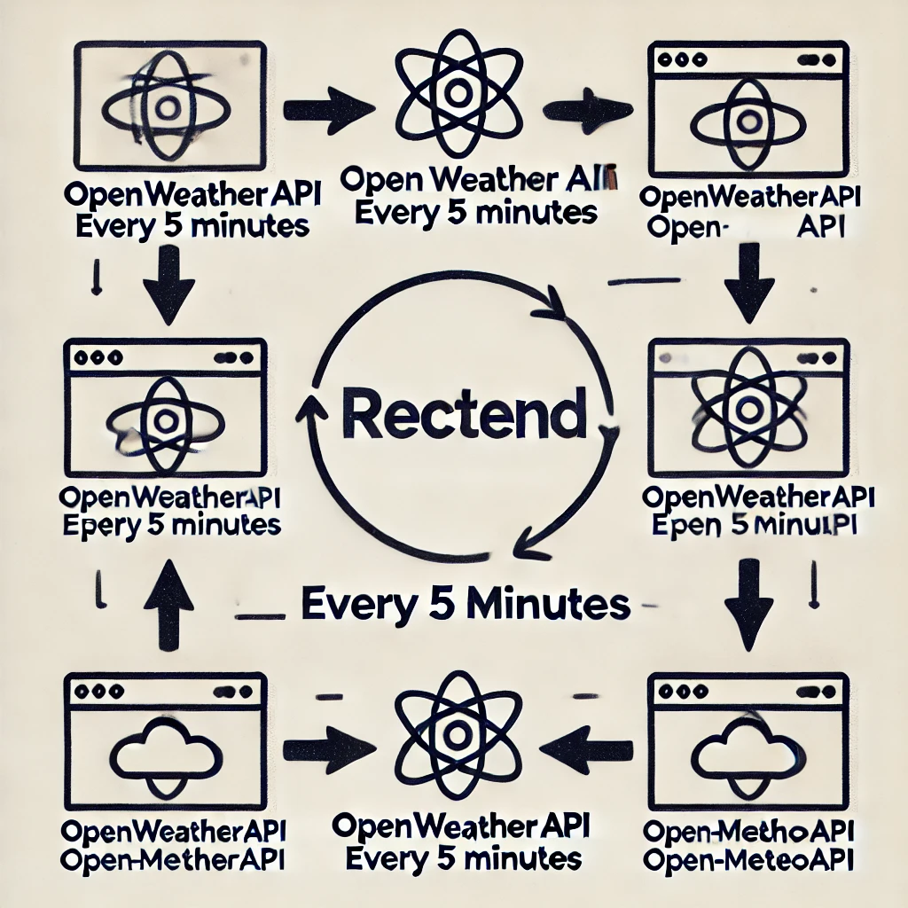
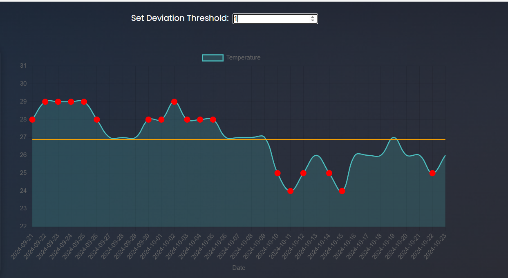

## Weather App

A weather app that tracks and displays minimum, maximum, average, and real-time temperatures with live, interactive charts for historical data. Users receive threshold alerts when temperatures exceed set limits, providing timely insights. It’s ideal for real-time monitoring, trend analysis, and staying updated on temperature fluctuations.

## Features

- **Temperature Tracking**: Displays minimum, maximum, average, and actual temperatures in real-time.
- **Historical Data Visualization**: Interactive charts show temperature trends over time for in-depth analysis.
- **Threshold Alerts**: Notifies users when temperature values exceed predefined limits.
- **User-Friendly Interface**: A simple, responsive layout for easy navigation and quick insights.  

## Tech Stack

- **Frontend**: HTML, CSS, JavaScript, React
- **Database**: MongoDB
- **Charts**: Chart.js or react-chartjs-2 for live data visualization
- **APIs**: Weather API for temperature data retrieval

### A Go through

Start the Project using following command

npm start 

It will start running on localhost 3000 on the default browser

This placard provides a comprehensive view of temperature data for major metro cities, fetched and updated every 5 minutes using the OpenWeatherMap API. It allows users to monitor temperature fluctuations in real-time, with added customization options for temperature units and alert settings.

Users can switch between Celsius and Fahrenheit, ensuring flexibility based on preference.

An interactive line chart displays historical temperature records, helping users track patterns or seasonal variations.Uses the Open-Meteo API to fetch historical temperature data, enabling a detailed analysis of temperature trends over time.

Users can set a threshold limit (deviation from the city’s average temperature) that, when exceeded, displays a red dot on the chart for easy identification.

